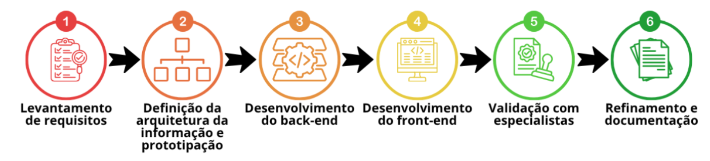
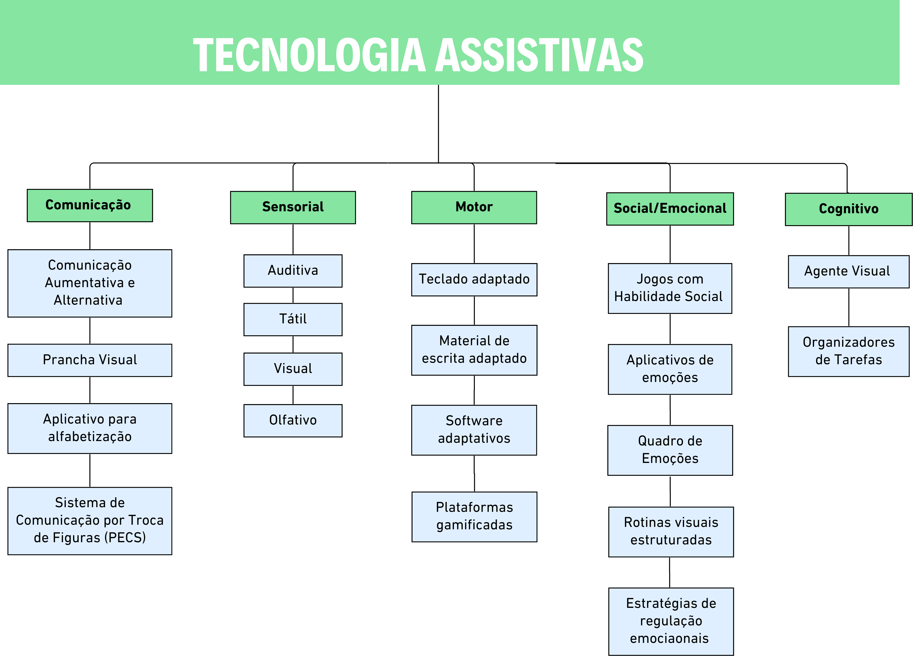
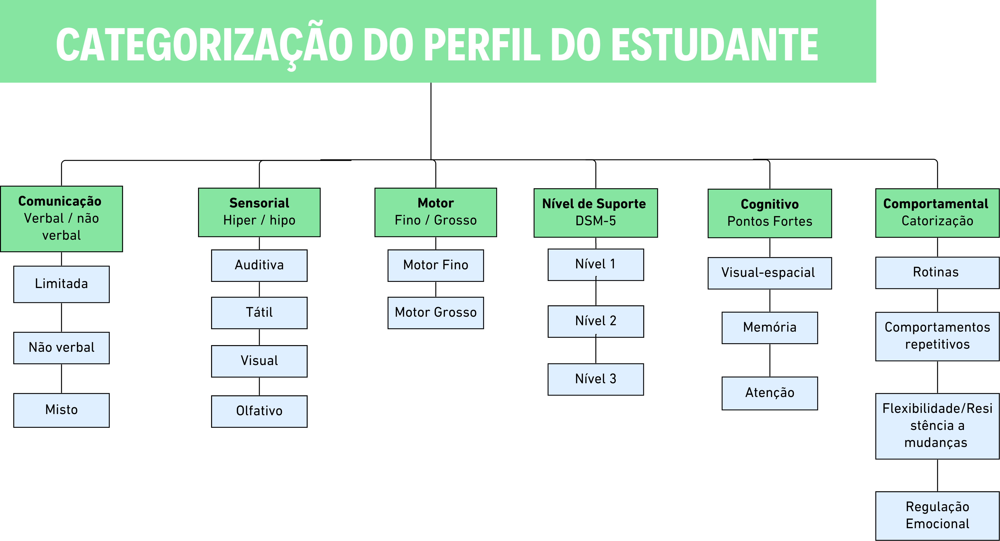
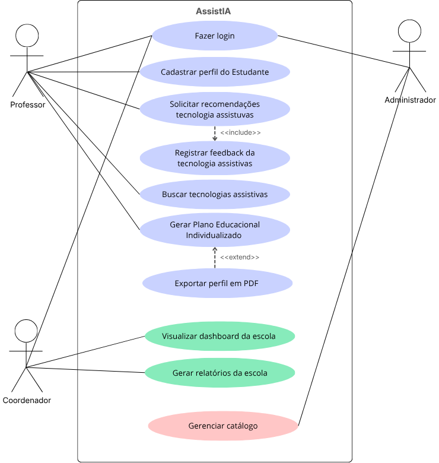
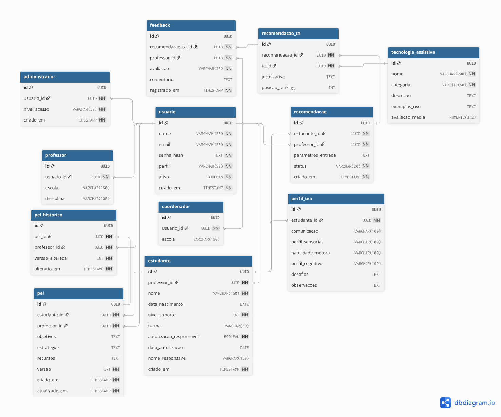

# 📚 AssistIA - Documentação Completa do Projeto

## Sistema de Recomendação de Tecnologias Assistivas para TEA

---

## 📋 Índice

1. [Sobre o Projeto](#sobre-o-projeto)
2. [Etapas da Pesquisa](#etapas-da-pesquisa)
3. [Análise de Requisitos](#análise-de-requisitos)
4. [Arquitetura e Prototipação](#arquitetura-e-prototipação)
5. [Tecnologias Utilizadas](#tecnologias-utilizadas)
6. [Estrutura do Projeto](#estrutura-do-projeto)
7. [Comandos Úteis](#comandos-úteis)
8. [Erros e Soluções](#erros-e-soluções)
9. [Melhorias Implementadas](#melhorias-implementadas)
10. [Próximos Passos](#próximos-passos)
11. [Licença](#licença)

---

## Sobre o Projeto

O **AssistIA** é um sistema web desenvolvido para auxiliar profissionais da educação (professores, coordenadores e especialistas) a recomendar tecnologias assistivas para alunos com Transtorno do Espectro Autista (TEA). O sistema utiliza inteligência artificial para analisar o perfil do aluno e sugerir recursos personalizados.

### Público-Alvo

| Stakeholder | Descrição |
|-------------|-----------|
| **Professores** | Gerenciam alunos, geram recomendações e PEIs |
| **Coordenadores** | Supervisionam professores e acompanham resultados |
| **Especialistas** | Validam recomendações e ajustam o sistema |
| **Alunos TEA** | Beneficiários indiretos do sistema |

### Status Atual

- ✅ Telas para professores completamente funcionais
- ✅ Sistema de avaliação com estrelas
- ✅ Acessibilidade WCAG 2.1 nível AA
- ⏳ Telas para coordenadores (em desenvolvimento)
- ⏳ Telas para especialistas (planejadas)

---

## Etapas da Pesquisa

A pesquisa foi estruturada em seis etapas metodológicas, conforme ilustrado na figura abaixo:



### Etapa 1 – Delineamento do Referencial Teórico
Estruturação da base teórica sobre TEA, tecnologias assistivas e educação inclusiva, com fundamentação em DSM-5, CID-11 e legislação brasileira.

### Etapa 2 – Análise de Requisitos e Projeto
Identificação de stakeholders, especificação de requisitos funcionais e não funcionais, regras de negócio, diagramas UML e MER.

### Etapa 3 – Definição de Arquitetura e Prototipação
Elaboração de taxonomias, arquitetura da informação e wireframes de baixa fidelidade.

### Etapa 4 – Desenvolvimento de Back-End
Implementação da lógica de negócio, API, banco de dados e segurança.

### Etapa 5 – Desenvolvimento de Front-End
Criação da interface visual responsiva e acessível.

### Etapa 6 – Aplicação e Avaliação do Protótipo
Testes com usuários, aplicação do questionário SUS e análise de feedbacks.

---

## Análise de Requisitos

### Stakeholders

| ID | Stakeholder | Descrição |
|----|-------------|-----------|
| 1 | **Coordenadores** | Supervisionam professores e acompanham resultados |
| 2 | **Professores** | Utilizam o sistema para gerenciar alunos e recomendações |
| 3 | **Especialistas** | Validam recomendações e ajustam o sistema |
| 4 | **Alunos TEA** | Beneficiários indiretos das ações planejadas |

### Requisitos Funcionais (RF)

| ID | Requisito Funcional | Stakeholder |
|----|---------------------|-------------|
| RF1 | Gerar recomendações de TA com base no perfil do estudante, utilizando IA | Professores |
| RF2 | Criar e logar em uma conta | Todos |
| RF3 | Gerar, editar e exportar PEI em PDF | Professores |
| RF4 | Registrar nível de suporte (DSM-5) e características do estudante | Professores/Especialistas |
| RF5 | Exibir catálogo de TAs filtrado por categoria | Professores/Especialistas |
| RF6 | Gerar relatório de evolução do aluno | Professores |
| RF7 | Tutorial de uso do sistema | Todos |

### Requisitos Não Funcionais (RNF)

| ID | Requisito Não Funcional | Stakeholder |
|----|-------------------------|-------------|
| RNF1 | Interface seguir WCAG 2.1 | Todos |
| RNF2 | Implementar atributos WAI-ARIA | Todos |
| RNF3 | Carregamento em menos de 3 segundos | Todos |
| RNF4 | Segurança em criptografia e conformidade com LGPD | Todos |
| RNF5 | Compatibilidade com navegadores | Todos |
| RNF6 | Responsividade em diferentes dispositivos | Todos |

### Regras de Negócio (RN)

| ID | Regra de Negócio | Stakeholder |
|----|------------------|-------------|
| RN1 | Só gera recomendação com perfil ≥ 70% preenchido | Professores |
| RN2 | Recomendações geradas pela IA são dados inseridos pelo professor | Professores |
| RN3 | Feedbacks dos professores para melhorar o sistema | Professores |
| RN4 | Professores editam perfis; coordenadores têm acesso somente de leitura | Professores/Coordenadores |
| RN5 | Estudantes menores de idade só podem ser cadastrados com autorização | Professores |
| RN6 | Somente administradores podem gerenciar o catálogo de TAs | ADM |

---

## Arquitetura e Prototipação

### Taxonomia das Tecnologias Assistivas



### Categorização do Perfil do Estudante



### Diagrama de Estudo de Caso (UML)



### Modelo Entidade-Relacionamento (MER)



### Wireframes das Telas

Os wireframes de baixa fidelidade representam as principais telas da plataforma:

| Tela | Descrição | 
|------|-----------|
| **Painel Principal** | Dashboard com cards de estatísticas e lista de alunos |
| **Perfil do Aluno** | Cadastro completo com barra de progresso e abas de navegação |
| **Recomendações IA** | Seleção de áreas de foco e recursos disponíveis |
| **Catálogo de TAs** | Busca e filtros por categoria com cards descritivos |

> **Link para Wireframe Estruturado:** [miro - Wireframes AssistIA](https://miro.com/app/board/uXjVG0o8EKQ=/)

---

## Tecnologias Utilizadas

### Backend

| Tecnologia | Versão | Finalidade |
|------------|--------|------------|
| **Python** | 3.12.3 | Linguagem principal |
| **Django** | 6.0 | Framework web |
| **Django REST Framework** | 3.17.1 | API |
| **PostgreSQL** | 16 | Banco de dados |
| **Argon2** | 25.1.0 | Criptografia de senhas |
| **JWT** | 5.5.1 | Autenticação |
| **PyOTP** | 2.10.0 | Autenticação de dois fatores |

### Frontend

| Tecnologia | Versão | Finalidade |
|------------|--------|------------|
| **Bootstrap** | 5.3.0 | Framework CSS responsivo |
| **HTML5** | - | Estrutura das páginas |
| **CSS3** | - | Estilização |
| **JavaScript** | - | Interatividade |
| **jQuery** | 3.7.0 | Manipulação DOM |
| **Font Awesome** | 6.4.0 | Ícones |
| **SweetAlert2** | 11.0 | Alertas e modais |

### IA e APIs

| Tecnologia | Finalidade |
|------------|------------|
| **FastAPI** | API de recomendação |
| **TinyLlama-1.1B** | Modelo de IA para recomendações |
| **Requests** | Comunicação entre APIs |

### Segurança

| Tecnologia | Finalidade |
|------------|------------|
| **Argon2** | Hash de senhas |
| **JWT** | Tokens de autenticação |
| **2FA (OTP)** | Autenticação de dois fatores |
| **Rate Limiting** | Proteção contra brute force |
| **CSRF Protection** | Proteção contra ataques CSRF |
| **Headers de Segurança** | XSS, Clickjacking, HSTS |

---

## Estrutura do Projeto

```
AssistIA_site/
├── docs/                          # imagens no Readme.md                       
│   └── image
│
├── assistIA/                      # Configurações do projeto
│   ├── __init__.py
│   ├── settings.py                # Configurações principais
│   ├── urls.py                    # URLs principais
│   ├── asgi.py                    # ASGI config
│   └── wsgi.py                    # WSGI config
│
├── user/                          # App de autenticação
│   ├── migrations/
│   ├── templates/auth/            # Templates de autenticação
│   │   ├── base.html
│   │   ├── login.html
│   │   ├── cadastro.html
│   │   ├── esqueci_senha.html
│   │   ├── redefinir_senha.html
│   │   └── verificar_otp.html
│   ├── models.py                  # Modelo Usuario
│   ├── views.py                   # Views de autenticação
│   ├── urls.py                    # URLs de autenticação
│   ├── serializers.py             # Serializers
│   ├── utils.py                   # Utilitários (OTP)
│   └── security_logger.py         # Logs de segurança
│
├── telas/                         # App principal
│   ├── migrations/
│   ├── templates/                 # Templates do sistema
│   │   ├── telas/
│   │   │   ├── base.html          # Base das telas internas
│   │   │   └── dashboard.html     # Dashboard
│   │   ├── estudantes/            # Gestão de alunos
│   │   │   ├── lista.html
│   │   │   ├── form.html
│   │   │   └── detalhe.html
│   │   ├── pei/                   # Planos Educacionais
│   │   │   ├── lista.html
│   │   │   ├── gerar.html
│   │   │   ├── detalhe.html
│   │   │   └── form.html
│   │   ├── perfil/                # Perfil do usuário
│   │   │   └── perfil.html
│   │   ├── recomendacoes/         # Recomendações
│   │   │   ├── lista.html
│   │   │   ├── gerar.html
│   │   │   └── detalhe.html
│   │   └── tecnologias/           # Catálogo de TAs
│   │       └── catalogo.html
│   ├── models.py                  # Modelos do sistema
│   ├── views.py                   # Views do sistema
│   └── urls.py                    # URLs do sistema
│
├── static/                        # Arquivos estáticos
│   └── css/
│       └── style.css              # CSS global
├── staticfiles/                   # Coletados pelo Django
├── logs/                          # Logs do sistema
├── .env                           # Variáveis de ambiente
├── manage.py                      # Gerenciador do Django
├── requirements.txt               # Dependências
└── README.md                      # Documentação
```

## Comandos Úteis

### Gerenciamento do Projeto

```bash
# Rodar servidor de desenvolvimento
python manage.py runserver
python manage.py runserver 8002

# Criar migrações
python manage.py makemigrations
python manage.py migrate

# Criar superusuário
python manage.py createsuperuser

# Coletar arquivos estáticos
python manage.py collectstatic --noinput

# Verificar configurações
python manage.py check

# Shell interativo
python manage.py shell

# Mostrar URLs
python manage.py show_urls
```

## Erros e Soluções

### 1. IA Enviando Recomendações para o Catálogo

**Problema:** A IA estava criando tecnologias diretamente no catálogo, poluindo o sistema com nomes genéricos.

**Solução:** Adicionado campo `criada_por_ia` no modelo e filtro no catálogo.

| Problema | Antes | Depois |
|----------|-------|--------|
| **Criação de Tecnologias** | IA criava diretamente no catálogo | IA apenas recomenda tecnologias existentes |
| **Catálogo** | Poluído com nomes genéricos | Limpo com apenas tecnologias fixas |
| **Informações** | Tecnologias sem dados completos | Tecnologias com dados estruturados |
| **Diferenciação** | Difícil distinguir | Campo `criada_por_ia` para diferenciar |
| **Filtragem** | Mostrava todas | Filtra apenas fixas (`criada_por_ia=False`) |

### 2. Erro: `ModuleNotFoundError: No module named 'environ'`

```bash
pip install django-environ python-dotenv
```

### 3. Erro: `password authentication failed for user "postgres"`

```bash
sudo -u postgres psql
ALTER USER postgres WITH PASSWORD 'nova_senha';
\q
```

### 4. Erro: `TemplateDoesNotExist: telas/estudantes/form.html`

```bash
mkdir -p telas/templates/estudantes
```

### 5. Erro: `Network is unreachable` (email)

```python
# settings.py
EMAIL_BACKEND = 'django.core.mail.backends.console.EmailBackend'
```

### 6. Erro: `salvar_perfil_tea() got an unexpected keyword argument 'id'`

```python
# telas/urls.py
path('estudantes/<uuid:estudante_id>/salvar-perfil/', views.salvar_perfil_tea, name='salvar_perfil_tea'),

# telas/views.py
def salvar_perfil_tea(request, estudante_id):
    estudante = get_object_or_404(Estudante, id=estudante_id, professor=request.user)
```

### 7. Erro: `Tag start is not closed` no template

```html
<!-- Errado -->


<!-- Correto -->

```

### 8. Erro: `ModuleNotFoundError: No module named 'AssistIA'`

```bash
sed -i "s/AssistIA.settings/assistIA.settings/g" manage.py
sed -i "s/AssistIA.urls/assistIA.urls/g" assistIA/settings.py
```

### 9. Erro: CSS não carregando (404)

```bash
mkdir -p static/css
cat > static/css/style.css << 'EOF'
/* CSS content */
EOF
python manage.py collectstatic --noinput
```

### 10. Erro: 404 ao excluir recomendação

```javascript
// Corrigir de /app/ para /telas/
fetch(`/telas/recomendacoes/${id}/excluir/`, {
    method: 'POST',
    headers: {
        'X-CSRFToken': '{{ csrf_token }}',
    },
})
```

---

## Melhorias Implementadas

### Arquitetura
- ✅ Estrutura de pastas reorganizada
- ✅ Apps separados por responsabilidade (user, telas)
- ✅ URLs organizadas e semânticas

### Segurança
- ✅ Argon2 para criptografia de senhas
- ✅ 2FA com OTP
- ✅ JWT para autenticação
- ✅ Headers de segurança
- ✅ Rate limiting
- ✅ CSRF protection
- ✅ Bloqueio por tentativas de login

### Interface
- ✅ Design responsivo com Bootstrap 5
- ✅ CSS global centralizado
- ✅ Ícones Font Awesome
- ✅ Alertas e modais com SweetAlert2
- ✅ Estrela ✨ para indicar IA

### Funcionalidades
- ✅ CRUD completo de alunos
- ✅ Perfil TEA com modal
- ✅ Catálogo de tecnologias com filtros
- ✅ Recomendações com IA
- ✅ Feedback de recomendações
- ✅ PEIs com versionamento
- ✅ Geração de PDF
- ✅ Lista de recomendações com filtros e busca
- ✅ Sistema de avaliação com estrelas
- ✅ Acessibilidade WCAG 2.1 nível AA

---

## Próximos Passos

### Segurança Avançada

| Item | Descrição | Status |
|------|-----------|--------|
| **Hardening de Senhas** | Histórico de senhas, notificação de senhas fracas | ✅ Feito |
| **Honeypot** | Campos ocultos, tempo de preenchimento, bloqueio de IPs | ✅ Feito |
| **Logs de Monitoramento** | Logs estruturados em JSON, alertas de múltiplas falhas | ✅ Feito |
| **Histórico de Senhas** | Evitar reutilização de senhas | ✅ Feito |
| **Login com 2FA** | Já tem a estrutura, falta integrar com login | ✅ Feito |
| **Automação de Segurança** | Backup automatizado, rotação de chaves, scan de vulnerabilidades | ⏳ Planejado |

### Telas para Coordenadores

| Item | Descrição | Status |
|------|-----------|--------|
| **Dashboard do Coordenador** | Visão geral de todos os professores, estatísticas | ⏳ Em desenvolvimento |
| **Acompanhamento de Professores** | Lista de professores, atividades recentes | ⏳ Em desenvolvimento |

### Telas para Especialistas

| Item | Descrição | Status |
|------|-----------|--------|
| **Validação de Recomendações** | Revisão de recomendações geradas pela IA | ⏳ Planejado |
| **Configurações do Sistema** | Ajuste do modelo de IA, gerenciamento de usuários | ⏳ Planejado |

### Funcionalidades Adicionais

| Item | Descrição | Status |
|------|-----------|--------|
| **Notificações** | Email de novas recomendações, alertas de segurança | ⏳ Planejado |
| **Exportação** | Relatórios em PDF, exportação em CSV | ⏳ Planejado |
| **Performance** | Cache de consultas, paginação otimizada | ⏳ Planejado |

---

## Licença

Este projeto está sob a licença MIT.

---

**Última atualização do código:** 13 de Julho de 2026

**Desenvolvedora:** Laura

**Links:**
- **API de IA**: https://api-assitia.onrender.com
- **Documentação do TCC**: https://docs.google.com/document/d/1M4p_rf9ZomxLC8pR7ZDh3RJaT84Q3WEdXk2KfDmH6RI/edit?tab=t.8yh8xakvjh4w

---

**Obrigada por utilizar o AssistIA!** 🚀
