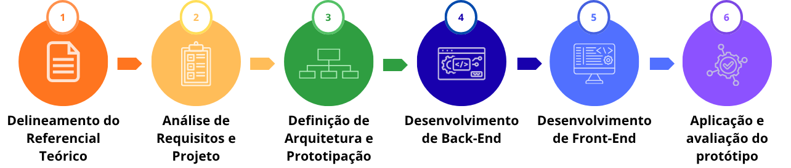

# 📚 AssistIA - Documentação Completa do Projeto

## Sistema de Recomendação de Tecnologias Assistivas para TEA

---

## 📋 Índice

1. [Sobre o Projeto](#sobre-o-projeto)
2. [Etapas da Pesquisa](#etapas-da-pesquisa)
3. [Análise de Requisitos](#análise-de-requisitos)
4. [Arquitetura e Prototipação](#arquitetura-e-prototipação)
5. [Tecnologias Utilizadas](#tecnologias-utilizadas)
6. [Estrutura do Projeto](#estrutura-do-projeto)
7. [Configuração Inicial](#configuração-inicial)
8. [Banco de Dados PostgreSQL](#banco-de-dados-postgresql)
9. [Modelos do Sistema](#modelos-do-sistema)
10. [Autenticação e Segurança](#autenticação-e-segurança)
11. [Telas e Funcionalidades](#telas-e-funcionalidades)
12. [Integração com API de IA](#integração-com-api-de-ia)
13. [Comandos Úteis](#comandos-úteis)
14. [Erros e Soluções](#erros-e-soluções)
15. [Melhorias Implementadas](#melhorias-implementadas)
16. [Próximos Passos](#próximos-passos)
17. [Licença](#licença)

---

## Sobre o Projeto

O **AssistIA** é um sistema web desenvolvido para auxiliar profissionais da educação (professores, coordenadores e especialistas) a recomendar tecnologias assistivas para alunos com Transtorno do Espectro Autista (TEA). O sistema utiliza inteligência artificial para analisar o perfil do aluno e sugerir recursos personalizados.

### 🎯 Público-Alvo

| Stakeholder | Descrição |
|-------------|-----------|
| **Professores** | Gerenciam alunos, geram recomendações e PEIs |
| **Coordenadores** | Supervisionam professores e acompanham resultados |
| **Especialistas** | Validam recomendações e ajustam o sistema |
| **Alunos TEA** | Beneficiários indiretos do sistema |

### 📌 Status Atual

- ✅ Telas para professores completamente funcionais
- ⏳ Telas para coordenadores (em desenvolvimento)
- ⏳ Telas para especialistas (planejadas)

---

## Etapas da Pesquisa

A pesquisa foi estruturada em seis etapas metodológicas, conforme ilustrado na figura abaixo:



### Etapa 1 – Delineamento do Referencial Teórico
Estruturação da base teórica sobre TEA, tecnologias assistivas e educação inclusiva, com fundamentação em DSM-5, CID-11 e legislação brasileira.

### Etapa 2 – Análise de Requisitos e Projeto
Identificação de stakeholders, especificação de requisitos funcionais e não funcionais, regras de negócio, diagramas UML e MER.

### Etapa 3 – Definição de Arquitetura e Prototipação
Elaboração de taxonomias, arquitetura da informação e wireframes de baixa fidelidade.

### Etapa 4 – Desenvolvimento de Back-End
Implementação da lógica de negócio, API, banco de dados e segurança.

### Etapa 5 – Desenvolvimento de Front-End
Criação da interface visual responsiva e acessível.

### Etapa 6 – Aplicação e Avaliação do Protótipo
Testes com usuários, aplicação do questionário SUS e análise de feedbacks.

---

## Análise de Requisitos

### Stakeholders

| ID | Stakeholder | Descrição |
|----|-------------|-----------|
| 1 | **Coordenadores** | Supervisionam professores e acompanham resultados |
| 2 | **Professores** | Utilizam o sistema para gerenciar alunos e recomendações |
| 3 | **Especialistas** | Validam recomendações e ajustam o sistema |
| 4 | **Alunos TEA** | Beneficiários indiretos das ações planejadas |

### Requisitos Funcionais (RF)

| ID | Requisito Funcional | Stakeholder |
|----|---------------------|-------------|
| RF1 | Gerar recomendações de TA com base no perfil do estudante, utilizando IA | Professores |
| RF2 | Criar e logar em uma conta | Todos |
| RF3 | Gerar, editar e exportar PEI em PDF | Professores |
| RF4 | Registrar nível de suporte (DSM-5) e características do estudante | Professores/Especialistas |
| RF5 | Exibir catálogo de TAs filtrado por categoria | Professores/Especialistas |
| RF6 | Gerar relatório de evolução do aluno | Professores |
| RF7 | Tutorial de uso do sistema | Todos |

### Requisitos Não Funcionais (RNF)

| ID | Requisito Não Funcional | Stakeholder |
|----|-------------------------|-------------|
| RNF1 | Interface seguir WCAG 2.1 | Todos |
| RNF2 | Implementar atributos WAI-ARIA | Todos |
| RNF3 | Carregamento em menos de 3 segundos | Todos |
| RNF4 | Segurança em criptografia e conformidade com LGPD | Todos |
| RNF5 | Compatibilidade com navegadores | Todos |
| RNF6 | Responsividade em diferentes dispositivos | Todos |

### Regras de Negócio (RN)

| ID | Regra de Negócio | Stakeholder |
|----|------------------|-------------|
| RN1 | Só gera recomendação com perfil ≥ 70% preenchido | Professores |
| RN2 | Recomendações geradas pela IA são dados inseridos pelo professor | Professores |
| RN3 | Feedbacks dos professores para melhorar o sistema | Professores |
| RN4 | Professores editam perfis; coordenadores têm acesso somente de leitura | Professores/Coordenadores |
| RN5 | Estudantes menores de idade só podem ser cadastrados com autorização | Professores |
| RN6 | Somente administradores podem gerenciar o catálogo de TAs | ADM |

---

## Arquitetura e Prototipação

### Taxonomia das Tecnologias Assistivas


### Categorização do Perfil do Estudante


### Diagrama de Estudo de Caso (UML)


### Modelo Entidade-Relacionamento (MER)


### Wireframes das Telas

Os wireframes de baixa fidelidade representam as principais telas da plataforma:

| Tela | Descrição | 
|------|-----------|
| **Painel Principal** | Dashboard com cards de estatísticas e lista de alunos |
| **Perfil do Aluno** | Cadastro completo com barra de progresso e abas de navegação |
| **Recomendações IA** | Seleção de áreas de foco e recursos disponíveis |
| **Catálogo de TAs** | Busca e filtros por categoria com cards descritivos |

> **Link para Wireframe Estruturado:** [miro - Wireframes AssistIA](https://miro.com/app/board/uXjVG0o8EKQ=/)

---

## Tecnologias Utilizadas

### Backend

| Tecnologia | Versão | Finalidade |
|------------|--------|------------|
| **Python** | 3.12.3 | Linguagem principal |
| **Django** | 6.0 | Framework web |
| **Django REST Framework** | 3.17.1 | API |
| **PostgreSQL** | 16 | Banco de dados |
| **Argon2** | 25.1.0 | Criptografia de senhas |
| **JWT** | 5.5.1 | Autenticação |
| **PyOTP** | 2.10.0 | Autenticação de dois fatores |

### Frontend

| Tecnologia | Versão | Finalidade |
|------------|--------|------------|
| **Bootstrap** | 5.3.0 | Framework CSS responsivo |
| **HTML5** | - | Estrutura das páginas |
| **CSS3** | - | Estilização |
| **JavaScript** | - | Interatividade |
| **jQuery** | 3.7.0 | Manipulação DOM |
| **Font Awesome** | 6.4.0 | Ícones |
| **SweetAlert2** | 11.0 | Alertas e modais |

### IA e APIs

| Tecnologia | Finalidade |
|------------|------------|
| **FastAPI** | API de recomendação |
| **TinyLlama-1.1B** | Modelo de IA para recomendações |
| **Requests** | Comunicação entre APIs |

### Segurança

| Tecnologia | Finalidade |
|------------|------------|
| **Argon2** | Hash de senhas |
| **JWT** | Tokens de autenticação |
| **2FA (OTP)** | Autenticação de dois fatores |
| **Rate Limiting** | Proteção contra brute force |
| **CSRF Protection** | Proteção contra ataques CSRF |
| **Headers de Segurança** | XSS, Clickjacking, HSTS |

---

## Estrutura do Projeto

```
AssistIA_site/
├── docs/                          # imagens no Readme.md                       
│   ├── image
│
├── assistIA/                          # Configurações do projeto
│   ├── __init__.py
│   ├── settings.py                    # Configurações principais
│   ├── urls.py                        # URLs principais
│   ├── asgi.py                        # ASGI config
│   └── wsgi.py                        # WSGI config
│
├── user/                              # App de autenticação
│   ├── migrations/
│   ├── templates/auth/                # Templates de autenticação
│   │   ├── base.html
│   │   ├── login.html
│   │   ├── cadastro.html
│   │   ├── esqueci_senha.html
│   │   ├── redefinir_senha.html
│   │   └── verificar_otp.html
│   ├── models.py                      # Modelo Usuario
│   ├── views.py                       # Views de autenticação
│   ├── urls.py                        # URLs de autenticação
│   ├── serializers.py                 # Serializers
│   ├── utils.py                       # Utilitários (OTP)
│   └── security_logger.py             # Logs de segurança
│
├── telas/                             # App principal
│   ├── migrations/
│   ├── templates/                     # Templates do sistema
│   │   ├── telas/
│   │   │   ├── base.html              # Base das telas internas
│   │   │   └── dashboard.html         # Dashboard
│   │   ├── estudantes/                # Gestão de alunos
│   │   │   ├── lista.html
│   │   │   ├── form.html
│   │   │   └── detalhe.html
│   │   ├── pei/                       # Planos Educacionais
│   │   │   ├── lista.html
│   │   │   ├── gerar.html
│   │   │   ├── detalhe.html
│   │   │   └── form.html
│   │   ├── perfil/                    # Perfil do usuário
│   │   │   └── perfil.html
│   │   ├── recomendacoes/             # Recomendações
│   │   │   ├── lista.html
│   │   │   ├── gerar.html
│   │   │   └── detalhe.html
│   │   └── tecnologias/               # Catálogo de TAs
│   │       └── catalogo.html
│   ├── models.py                      # Modelos do sistema
│   ├── views.py                       # Views do sistema
│   └── urls.py                        # URLs do sistema
│
├── static/                            # Arquivos estáticos
│   └── css/
│       └── style.css                  # CSS global
├── staticfiles/                       # Coletados pelo Django
├── logs/                              # Logs do sistema
├── .env                               # Variáveis de ambiente
├── manage.py                          # Gerenciador do Django
├── requirements.txt                   # Dependências
└── README.md                          # Documentação
```

---

## Configuração Inicial

### 1. Criar Ambiente Virtual

```bash
# Criar ambiente virtual
python -m venv .venv

# Ativar ambiente virtual
source .venv/bin/activate  # Linux/Mac
.venv\Scripts\activate     # Windows
```

### 2. Instalar Dependências

```bash
# Instalar Django e dependências principais
pip install django==6.0
pip install django-environ==0.14.0
pip install psycopg2-binary==2.9.12
pip install djangorestframework==3.17.1
pip install djangorestframework-simplejwt==5.5.1
pip install django-cors-headers==4.9.0
pip install python-dotenv==1.2.2
pip install pyotp==2.10.0
pip install requests==2.34.2
pip install argon2-cffi==25.1.0
pip install django-filter==25.2
pip install drf-yasg==1.21.15
pip install django-allauth==65.18.0
pip install dj-rest-auth==7.2.0

# Salvar dependências
pip freeze > requirements.txt
```

### 3. Criar Projeto e Apps

```bash
# Criar projeto
django-admin startproject assistIA .
cd assistIA

# Criar apps
python manage.py startapp user
python manage.py startapp telas
```

### 4. Configurar `.env`

```bash
cat > .env << 'EOF'
# Django Settings
DJANGO_SECRET_KEY='django-insecure-2-rz8s9oCgs81jf9kGJuveTcIw0vFYIsbwn2UBtt6D1egFcnzS5DQP8wyU7k4b4d_tA'
DEBUG=True

# Hosts
ALLOWED_HOSTS=localhost,127.0.0.1,.onrender.com

# Database - PostgreSQL
DB_NAME=assitia_db
DB_USER=postgres
DB_PASSWORD=Cherry0601@
DB_HOST=localhost
DB_PORT=5432

# CORS
CORS_ALLOWED_ORIGINS=http://localhost:3000,http://localhost:8000,http://localhost:8002

# Email (desenvolvimento)
EMAIL_BACKEND=django.core.mail.backends.console.EmailBackend
EOF
```

---

## Banco de Dados PostgreSQL

### 1. Instalar PostgreSQL

```bash
# Ubuntu/Debian
sudo apt update
sudo apt install postgresql postgresql-contrib

# Verificar status
sudo systemctl status postgresql
```

### 2. Criar Banco e Usuário

```bash
# Acessar PostgreSQL
sudo -u postgres psql

# Dentro do psql:
CREATE DATABASE assitia_db;
GRANT ALL PRIVILEGES ON DATABASE assitia_db TO postgres;
\c assitia_db;
CREATE EXTENSION IF NOT EXISTS "uuid-ossp";
\q
```

### 3. Configurar Django para PostgreSQL

```python
# assistIA/settings.py
DATABASES = {
    'default': {
        'ENGINE': 'django.db.backends.postgresql',
        'NAME': os.getenv('DB_NAME', 'assitia_db'),
        'USER': os.getenv('DB_USER', 'postgres'),
        'PASSWORD': os.getenv('DB_PASSWORD', 'password'),
        'HOST': os.getenv('DB_HOST', 'localhost'),
        'PORT': os.getenv('DB_PORT', '5432'),
        'OPTIONS': {
            'connect_timeout': 10,
        }
    }
}
```

### 4. Migrar Banco

```bash
python manage.py makemigrations
python manage.py migrate
```

---

## Modelos do Sistema

### Usuario (`user/models.py`)

```python
class Usuario(AbstractBaseUser, PermissionsMixin):
    PERFIL_CHOICES = [
        ('professor', 'Professor'),
        ('coordenador', 'Coordenador'),
        ('especialista', 'Especialista'),
    ]
    
    id = models.UUIDField(primary_key=True, default=uuid.uuid4, editable=False)
    nome = models.CharField(max_length=150)
    email = models.EmailField(max_length=150, unique=True)
    perfil = models.CharField(max_length=20, choices=PERFIL_CHOICES)
    ativo = models.BooleanField(default=True)
    criado_em = models.DateTimeField(auto_now_add=True)
```

### TecnologiaAssistiva (`telas/models.py`)

```python
class TecnologiaAssistiva(models.Model):
    CATEGORIA_CHOICES = [
        ('comunicacao', 'Comunicação'),
        ('regulacao_sensorial', 'Regulação Sensorial'),
        ('motor', 'Motor'),
        ('cognitivo', 'Cognitivo'),
        ('interacao_social', 'Interação Social'),
        ('estruturacao', 'Estruturação'),
    ]
    
    id = models.UUIDField(primary_key=True, default=uuid.uuid4, editable=False)
    nome = models.CharField(max_length=200)
    categoria = models.CharField(max_length=50, choices=CATEGORIA_CHOICES)
    descricao = models.TextField(blank=True, null=True)
    materiais = models.TextField(blank=True, null=True)
    como_fazer = models.TextField(blank=True, null=True)
    como_usar = models.TextField(blank=True, null=True)
    para_que_serve = models.TextField(blank=True, null=True)
    criada_por_ia = models.BooleanField(default=False)
```

### Estudante (`telas/models.py`)

```python
class Estudante(models.Model):
    NIVEL_SUPORTE_CHOICES = [
        (1, 'Nível 1 - Suporte Leve'),
        (2, 'Nível 2 - Suporte Moderado'),
        (3, 'Nível 3 - Suporte Intensivo'),
    ]
    
    id = models.UUIDField(primary_key=True, default=uuid.uuid4, editable=False)
    professor = models.ForeignKey(settings.AUTH_USER_MODEL, on_delete=models.RESTRICT)
    nome = models.CharField(max_length=150)
    nivel_suporte = models.IntegerField(choices=NIVEL_SUPORTE_CHOICES)
    turma = models.CharField(max_length=50, blank=True, null=True)
    ativo = models.BooleanField(default=True)
```

---

## Autenticação e Segurança

### 1. Argon2 - Criptografia de Senhas

```python
# settings.py
PASSWORD_HASHERS = [
    'django.contrib.auth.hashers.Argon2PasswordHasher',
    'django.contrib.auth.hashers.PBKDF2PasswordHasher',
    'django.contrib.auth.hashers.PBKDF2SHA1PasswordHasher',
    'django.contrib.auth.hashers.BCryptSHA256PasswordHasher',
]
```

### 2. 2FA com OTP

```python
# user/utils.py
def send_otp(request, user):
    secret_key = pyotp.random_base32()
    totp = pyotp.TOTP(secret_key, interval=300)
    otp_code = totp.now()
    
    request.session['otp_secret_key'] = secret_key
    request.session['otp_valid_date'] = (datetime.now() + timedelta(minutes=5)).isoformat()
    
    print(f"🔐 Código OTP: {otp_code}")
    return True
```

### 3. JWT Configuration

```python
# settings.py
SIMPLE_JWT = {
    'ACCESS_TOKEN_LIFETIME': timedelta(minutes=30),
    'REFRESH_TOKEN_LIFETIME': timedelta(days=7),
    'ROTATE_REFRESH_TOKENS': True,
    'BLACKLIST_AFTER_ROTATION': True,
}
```

### 4. Headers de Segurança

```python
# settings.py
SECURE_SSL_REDIRECT = not DEBUG
SESSION_COOKIE_SECURE = not DEBUG
CSRF_COOKIE_SECURE = not DEBUG
SECURE_BROWSER_XSS_FILTER = True
SECURE_CONTENT_TYPE_NOSNIFF = True
X_FRAME_OPTIONS = 'DENY'
SECURE_HSTS_SECONDS = 31536000
```

### 5. Rate Limiting e Bloqueio

```python
# user/views.py
def login_view(request):
    if 'tentativas_login' not in request.session:
        request.session['tentativas_login'] = 0
    
    if request.session['tentativas_login'] >= 5:
        messages.error(request, 'Muitas tentativas. Tente novamente em 5 minutos.')
        return render(request, 'auth/login.html')
    
    if usuario is not None:
        request.session['tentativas_login'] = 0    else:
        request.session['tentativas_login'] += 1
```

---

## Telas e Funcionalidades

### Telas de Autenticação (`auth/`)

| Tela | URL | Descrição |
|------|-----|-----------|
| Login | `/auth/login/` | Tela de login com 2FA |
| Cadastro | `/auth/cadastro/` | Cadastro de novos usuários |
| Esqueci Senha | `/auth/esqueci-senha/` | Recuperação de senha |
| Redefinir Senha | `/auth/redefinir-senha/<uid>/<token>/` | Redefinição de senha |
| Verificar OTP | `/auth/verificar-otp/` | Verificação de 2FA |

### Telas do Sistema (`telas/`)

| Tela | URL | Descrição |
|------|-----|-----------|
| Dashboard | `/telas/` | Visão geral do professor |
| Lista de Alunos | `/telas/estudantes/` | Gerenciamento de alunos |
| Cadastro de Aluno | `/telas/estudantes/novo/` | Criar novo aluno |
| Detalhe do Aluno | `/telas/estudantes/<id>/` | Perfil completo do aluno |
| Catálogo de TAs | `/telas/tecnologias/catalogo/` | Catálogo de tecnologias |
| Lista de Recomendações | `/telas/recomendacoes/` | Recomendações geradas |
| Gerar Recomendação | `/telas/recomendacoes/gerar/<id>/` | Recomendação com IA |
| Detalhe Recomendação | `/telas/recomendacoes/<id>/` | Detalhes da recomendação |
| Lista de PEIs | `/telas/pei/` | Planos Educacionais |
| Gerar PEI | `/telas/pei/gerar/<id>/` | Criar PEI |
| Detalhe PEI | `/telas/pei/<id>/` | Visualizar PEI |
| Perfil do Usuário | `/telas/perfil/` | Editar perfil |

### Funcionalidades Principais

1. **CRUD de Alunos** - Criar, ler, editar e deletar alunos
2. **Perfil TEA** - Cadastro de perfil completo do aluno
3. **Catálogo de TAs** - Visualização de todas as tecnologias disponíveis
4. **Recomendações com IA** - Geração de recomendações personalizadas
5. **Feedback de Recomendações** - Aceitar, testar ou rejeitar recomendações
6. **PEIs** - Criação e edição de Planos Educacionais Individualizados
7. **PDF de PEIs** - Geração de PDF para impressão
8. **2FA** - Autenticação de dois fatores por OTP
9. **Perfil do Usuário** - Edição de dados e alteração de senha

---

## Integração com API de IA

### API FastAPI no Render

- **URL**: `https://api-assitia.onrender.com`
- **Documentação**: `https://api-assitia.onrender.com/docs`

### Endpoint Principal

```http
POST /analisar-aluno-tea/
```

**Request:**
```json
{
    "descricao_professor": "Aluno com dificuldade de comunicação...",
    "idade_aluno": 8,
    "nivel_suporte": "2",
    "interesses_especificos": "Música, desenhos",
    "sensibilidades_sensoriais": "Sons altos, luzes fortes",
    "comunicacao": "Não Verbal",
    "motor": "Coordenação Fina"
}
```

**Response:**
```json
{
    "analise": "Análise detalhada com recomendações...",
    "categorias_necessidade": {
        "comunicacao": "Alta",
        "motor": "Média"
    },
    "estruturas_recomendadas": ["prancha_comunicacao", "kit_sensorial"]
}
```

### Integração no Django

```python
# telas/views.py
def gerar_recomendacao(request, estudante_id):
    payload = {
        "descricao_professor": descricao,
        "idade_aluno": idade,
        "nivel_suporte": str(estudante.nivel_suporte),
    }
    
    response = requests.post(
        'https://api-assitia.onrender.com/analisar-aluno-tea/',
        json=payload,
        timeout=30
    )
    
    if response.status_code == 200:
        resultado = response.json()
        # Processar e salvar recomendações
```

---

## Comandos Úteis

### Gerenciamento do Projeto

```bash
# Rodar servidor de desenvolvimento
python manage.py runserver
python manage.py runserver 8002

# Criar migrações
python manage.py makemigrations
python manage.py migrate

# Criar superusuário
python manage.py createsuperuser

# Coletar arquivos estáticos
python manage.py collectstatic --noinput

# Verificar configurações
python manage.py check

# Shell interativo
python manage.py shell

# Mostrar URLs
python manage.py show_urls
```

### Gerenciamento do Banco de Dados

```bash
# Acessar PostgreSQL
sudo -u postgres psql
psql -U postgres -d assitia_db

# Comandos no psql
\l              # Listar bancos
\c assitia_db  # Conectar ao banco
\dt            # Listar tabelas
\q             # Sair

# Backup e Restore
pg_dump -U postgres assitia_db > backup.sql
psql -U postgres assitia_db < backup.sql
```

### Ambiente Virtual

```bash
# Criar
python -m venv .venv

# Ativar
source .venv/bin/activate  # Linux/Mac
.venv\Scripts\activate     # Windows

# Desativar
deactivate

# Dependências
pip freeze > requirements.txt
pip install -r requirements.txt
```

### Ferramentas de Desenvolvimento

```bash
# Limpar cache Python
find . -type d -name "__pycache__" -exec rm -rf {} + 2>/dev/null
find . -type f -name "*.pyc" -delete

# Matar processos na porta 8000
sudo fuser -k 8000/tcp
sudo fuser -k 8001/tcp

# Verificar processos
ps aux | grep python
lsof -i :8000
```

---

## Erros e Soluções

### 1. IA Enviando Recomendações para o Catálogo

**Problema:** A IA estava criando tecnologias diretamente no catálogo, poluindo o sistema com nomes genéricos.

**Solução:** Adicionado campo `criada_por_ia` no modelo e filtro no catálogo.

| Problema | Antes | Depois |
|----------|-------|--------|
| **Criação de Tecnologias** | IA criava diretamente no catálogo | IA apenas recomenda tecnologias existentes |
| **Catálogo** | Poluído com nomes genéricos | Limpo com apenas tecnologias fixas |
| **Informações** | Tecnologias sem dados completos | Tecnologias com dados estruturados |
| **Diferenciação** | Difícil distinguir | Campo `criada_por_ia` para diferenciar |
| **Filtragem** | Mostrava todas | Filtra apenas fixas (`criada_por_ia=False`) |

### 2. Erro: `ModuleNotFoundError: No module named 'environ'`

```bash
pip install django-environ python-dotenv
```

### 3. Erro: `password authentication failed for user "postgres"`

```bash
sudo -u postgres psql
ALTER USER postgres WITH PASSWORD 'nova_senha';
\q
```

### 4. Erro: `TemplateDoesNotExist: telas/estudantes/form.html`

```bash
mkdir -p telas/templates/estudantes
```

### 5. Erro: `Network is unreachable` (email)

```python
# settings.py
EMAIL_BACKEND = 'django.core.mail.backends.console.EmailBackend'
```

### 6. Erro: `salvar_perfil_tea() got an unexpected keyword argument 'id'`

```python
# telas/urls.py
path('estudantes/<uuid:estudante_id>/salvar-perfil/', views.salvar_perfil_tea, name='salvar_perfil_tea'),

# telas/views.py
def salvar_perfil_tea(request, estudante_id):
    estudante = get_object_or_404(Estudante, id=estudante_id, professor=request.user)
```

### 7. Erro: `Tag start is not closed` no template

```html
<!-- Errado -->


<!-- Correto -->

```

### 8. Erro: `ModuleNotFoundError: No module named 'AssistIA'`

```bash
sed -i "s/AssistIA.settings/assistIA.settings/g" manage.py
sed -i "s/AssistIA.urls/assistIA.urls/g" assistIA/settings.py
```

### 9. Erro: CSS não carregando (404)

```bash
mkdir -p static/css
cat > static/css/style.css << 'EOF'
/* CSS content */
EOF
python manage.py collectstatic --noinput
```

### 10. Erro: 404 ao excluir recomendação

```javascript
// Corrigir de /app/ para /telas/
fetch(`/telas/recomendacoes/${id}/excluir/`, {
    method: 'POST',
    headers: {
        'X-CSRFToken': '{{ csrf_token }}',
    },
})
```

---

## Melhorias Implementadas

### 🚀 Arquitetura
- ✅ Estrutura de pastas reorganizada
- ✅ Apps separados por responsabilidade (user, telas)
- ✅ URLs organizadas e semânticas

### 🔐 Segurança
- ✅ Argon2 para criptografia de senhas
- ✅ 2FA com OTP
- ✅ JWT para autenticação
- ✅ Headers de segurança
- ✅ Rate limiting
- ✅ CSRF protection
- ✅ Bloqueio por tentativas de login

### 🎨 Interface
- ✅ Design responsivo com Bootstrap 5
- ✅ CSS global centralizado
- ✅ Ícones Font Awesome
- ✅ Alertas e modais com SweetAlert2
- ✅ Estrela ✨ para indicar IA

### ⚙️ Funcionalidades
- ✅ CRUD completo de alunos
- ✅ Perfil TEA com modal
- ✅ Catálogo de tecnologias com filtros
- ✅ Recomendações com IA
- ✅ Feedback de recomendações
- ✅ PEIs com versionamento
- ✅ Geração de PDF
- ✅ Lista de recomendações com filtros e busca

### 🗄️ Banco de Dados
- ✅ PostgreSQL com UUID
- ✅ Relacionamentos entre tabelas
- ✅ Índices para performance

---

## Próximos Passos

### 🔐 Segurança Avançada

| Item | Descrição | Status |
|------|-----------|--------|
| **Hardening de Senhas** | Histórico de senhas, notificação de senhas fracas | ⏳ Planejado |
| **Honeypot** | Campos ocultos, tempo de preenchimento, bloqueio de IPs | ⏳ Planejado |
| **Logs de Monitoramento** | Logs estruturados em JSON, alertas de múltiplas falhas | ⏳ Planejado |
| **Automação de Segurança** | Backup automatizado, rotação de chaves, scan de vulnerabilidades | ⏳ Planejado |

### 📊 Telas para Coordenadores

| Item | Descrição | Status |
|------|-----------|--------|
| **Dashboard do Coordenador** | Visão geral de todos os professores, estatísticas | ⏳ Em desenvolvimento |
| **Acompanhamento de Professores** | Lista de professores, atividades recentes | ⏳ Em desenvolvimento |

### 🧠 Telas para Especialistas

| Item | Descrição | Status |
|------|-----------|--------|
| **Validação de Recomendações** | Revisão de recomendações geradas pela IA | ⏳ Planejado |
| **Configurações do Sistema** | Ajuste do modelo de IA, gerenciamento de usuários | ⏳ Planejado |

### 🚀 Funcionalidades Adicionais

| Item | Descrição | Status |
|------|-----------|--------|
| **Notificações** | Email de novas recomendações, alertas de segurança | ⏳ Planejado |
| **Exportação** | Relatórios em PDF, exportação em CSV | ⏳ Planejado |
| **Performance** | Cache de consultas, paginação otimizada | ⏳ Planejado |

---

## Licença

Este projeto está sob a licença MIT.

---

**📅 Última atualização:** 24 de Junho de 2026

**👤 Desenvolvedora:** Laura

**🔗 Links:**
- **API de IA**: https://api-assitia.onrender.com
- **Documentação do TCC**: https://docs.google.com/document/d/1M4p_rf9ZomxLC8pR7ZDh3RJaT84Q3WEdXk2KfDmH6RI/edit?tab=t.8yh8xakvjh4w

---

**✨ Obrigada por utilizar o AssistIA!**
